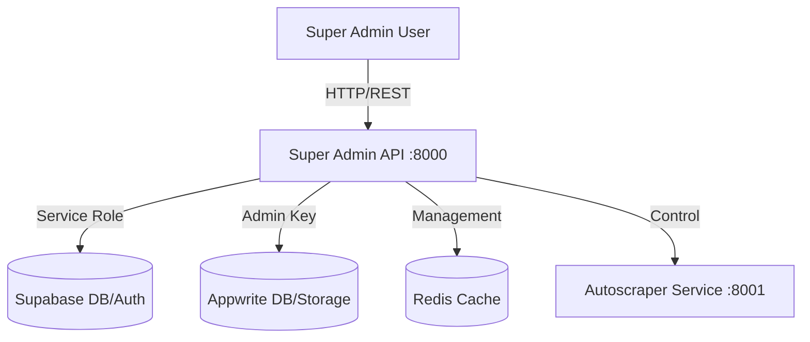

# Super Admin System Architecture

## 1. System Overview
The Super Admin System is a centralized control plane for the RemoteHive platform, operating on **localhost:8000**. It provides "Master Access" capabilities to manage all aspects of the ecosystem, including the Public Website, Employer Dashboard, and Job Seeker services.

## 2. Architecture
- **Core Service**: Python FastAPI Backend (Port 8000).
- **Database Access**: Direct orchestration of Supabase (PostgreSQL) and Appwrite via Admin SDKs.
- **Authentication**: Master-level authentication with Role-Based Access Control (RBAC).
- **Pattern**: Microservices Controller.

### Diagram

## 3. Functional Modules

### A. User Management
- **Unified View**: Aggregated view of Employers, Job Seekers, and Admins.
- **Actions**: Ban, Suspend, Verify, Promote/Demote.
- **Audit**: Log all status changes.

### B. Job Management
- **Moderation Queue**: Review jobs before publication.
- **Global Search**: Find any job by ID, Slug, or Company.
- **Operations**: Edit, Delete, Expire, Feature.

### C. System Configuration
- **Feature Flags**: Toggle global features (e.g., "Maintenance Mode", "Free Job Posting").
- **API Controls**: Rate limiting configuration, Whitelisting.

## 4. Technical Implementation

### Stack
- **Framework**: FastAPI (Python 3.10+)
- **ORM**: Beanie (MongoDB) or Supabase Client (PostgreSQL) - *Using Supabase per current architecture*.
- **Validation**: Pydantic Models.
- **Documentation**: OpenAPI (Swagger UI) at `/docs`.

### Security
- **Master Access**: Uses `SUPABASE_SERVICE_ROLE_KEY` for unrestricted database access.
- **Admin Auth**: JWT-based authentication specific to Super Admins (separate from Clerk user auth if needed, or using Clerk "admin" role).

## 5. API Specifications (Draft)

### Auth
- `POST /auth/login` - Admin login.
- `GET /auth/me` - Current admin info.

### Users
- `GET /admin/users` - List all users (paginated, filtered).
- `GET /admin/users/{id}` - Details.
- `PATCH /admin/users/{id}/status` - Ban/Unban.

### Jobs
- `GET /admin/jobs` - Global job list.
- `PATCH /admin/jobs/{id}/status` - Approve/Reject.

## 6. Development Roadmap
1. **Scaffold**: Setup FastAPI project structure.
2. **Auth**: Implement Admin Authentication middleware.
3. **Connect**: Integrate Supabase Admin Client.
4. **Modules**: Implement User and Job management endpoints.
5. **UI**: (Future) Build React Admin UI consuming this API.
